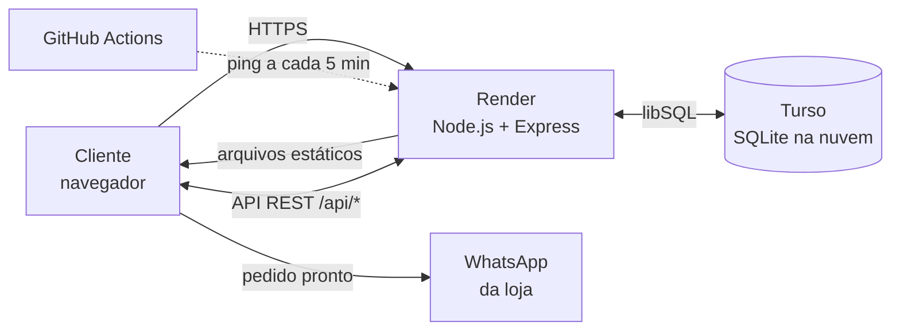

<div align="center">


# Almada Outlet

**Loja virtual de moda com catálogo gerenciável e pedidos finalizados pelo WhatsApp**

[](https://almada-outlet.onrender.com)


[**Ver o site →**](https://almada-outlet.onrender.com)

</div>

---

## Sobre o projeto

Site desenvolvido para a **Almada Outlet**, loja física de roupas e calçados em Santana do Livramento (RS). O objetivo foi dar à loja uma vitrine online que **o próprio dono consegue atualizar**, sem depender de um desenvolvedor para cadastrar produtos, trocar preços ou marcar o que esgotou.

O cliente monta o carrinho no site e finaliza o pedido no **WhatsApp da loja**, com uma mensagem já pronta contendo produtos, tamanhos, quantidades e subtotal.

O projeto está **em produção** em [almada-outlet.onrender.com](https://almada-outlet.onrender.com).

## Funcionalidades

### Para o cliente
- **Vitrine com busca e filtros** por categoria, faixa de preço e ordenação (destaques, preço, A–Z)
- **Seleção de tamanho/numeração** por produto, mostrando apenas o que há em estoque; produtos sem estoque aparecem como *Esgotado*
- **Carrinho persistente** (continua salvo ao fechar o navegador), com itens separados por tamanho
- **Checkout via WhatsApp**: gera a mensagem do pedido com itens, tamanhos, subtotal e observações
- Avisa se um tamanho esgotou enquanto o item estava no carrinho
- Layout **responsivo** (celular, tablet e desktop), mapa da loja e links para Instagram

### Para o dono da loja (painel administrativo)
- **Login com usuário e senha** (atalho `Ctrl + Shift + A`)
- **Cadastro, edição e exclusão de produtos**: nome, categoria, preço, descrição e destaque
- **Upload de foto com editor**: arrastar para enquadrar e zoom, com prévia de como vai aparecer na vitrine
- **Controle de tamanhos**: roupas (P, M, G, GG), calçados (37 a 44) ou tamanhos personalizados; quando uma peça vende, basta desmarcar
- **Configuração do WhatsApp** da loja e da mensagem padrão
- **Troca de usuário e senha** pelo próprio painel

## Tecnologias

| Camada | Tecnologias |
|---|---|
| **Front-end** | HTML5, CSS3 (variáveis, grid, animações), JavaScript puro (sem framework) |
| **Back-end** | Node.js 22, Express 4, API REST |
| **Banco de dados** | SQLite via libSQL: [Turso](https://turso.tech) em produção, arquivo local em desenvolvimento |
| **Autenticação** | Sessões em cookie `HttpOnly`, senhas com hash `bcrypt` |
| **Infraestrutura** | Render (hospedagem), Turso (banco), GitHub Actions (monitoramento) |

## Arquitetura



O mesmo servidor Express entrega o site e a API, então front-end e back-end ficam no mesmo domínio, sem necessidade de CORS. Os dados ficam no Turso, separados da hospedagem: deploys e reinícios do servidor não apagam nada.

### Rotas da API

| Método | Rota | Acesso | Descrição |
|---|---|---|---|
| `GET` | `/api/products` | público | Lista os produtos |
| `POST` | `/api/products` | admin | Cria produto |
| `PUT` | `/api/products/:id` | admin | Edita produto |
| `DELETE` | `/api/products/:id` | admin | Remove produto |
| `GET` | `/api/settings` | público | WhatsApp e mensagem padrão |
| `PUT` | `/api/settings` | admin | Atualiza configurações |
| `POST` | `/api/auth/login` | público | Inicia sessão |
| `POST` | `/api/auth/logout` | público | Encerra sessão |
| `GET` | `/api/auth/me` | público | Informa se a sessão é de admin |
| `PUT` | `/api/auth/credentials` | admin | Troca usuário/senha |

## Segurança

Por ser um site com área administrativa exposta na internet, a segurança foi tratada como requisito:

- **Senhas com hash bcrypt**: nunca armazenadas em texto puro
- **Sessões em cookie `HttpOnly` + `Secure` + `SameSite=Lax`**: inacessíveis ao JavaScript da página e enviadas só por HTTPS
- **Todas as rotas de escrita exigem sessão válida**, verificada no servidor (a interface esconder botões não é a proteção)
- **HTTPS obrigatório** em produção, com redirecionamento e cabeçalho HSTS
- **Lista fechada de arquivos públicos**: só o site é servido; código do servidor, `.env`, banco e arquivos de configuração respondem 404, inclusive contra tentativas de *path traversal* com caminhos codificados (`..%2f`)
- **Sem CORS**: outros sites não conseguem chamar a API pelo navegador
- **Escape de HTML** nos textos dinâmicos (nomes, categorias, descrições, tamanhos) exibidos na página
- **Recuperação de acesso** pelo servidor (`npm run reset-admin`) ou por variável de ambiente, sem fluxo de "esqueci a senha" exposto no site

## Rodando localmente

**Pré-requisito:** Node.js 20 ou superior.

```bash
git clone https://github.com/lucasreppetto010-cpu/Almada-outlet.git
cd Almada-outlet/server
npm install
cp .env.example .env   # ajuste ADMIN_PASSWORD
npm run dev
```

Acesse **http://localhost:3000**. Sem as variáveis do Turso, o servidor usa um arquivo SQLite local e cria produtos de exemplo. O painel admin abre com `Ctrl + Shift + A`.

### Variáveis de ambiente

| Variável | Descrição |
|---|---|
| `PORT` | Porta do servidor (padrão `3000`) |
| `NODE_ENV` | `production` liga HTTPS obrigatório e cookie seguro |
| `TURSO_DATABASE_URL` / `TURSO_AUTH_TOKEN` | Conexão com o Turso. Sem elas, usa SQLite local |
| `ADMIN_USER` / `ADMIN_PASSWORD` | Credenciais criadas na primeira inicialização |
| `ADMIN_RESET_PASSWORD` | Redefine a senha do admin ao iniciar (recuperação de acesso) |

## Deploy

O repositório inclui um [`render.yaml`](render.yaml) (Blueprint do Render). O deploy é automático a cada push na branch `main`:

1. Criar um banco no **Turso** e gerar o token de acesso
2. No **Render**, *New → Blueprint* apontando para este repositório
3. Preencher `TURSO_DATABASE_URL`, `TURSO_AUTH_TOKEN` e `ADMIN_PASSWORD`

O workflow [`manter-acordado.yml`](.github/workflows/manter-acordado.yml) acessa o site a cada 5 minutos para que a instância gratuita do Render não hiberne.

## Estrutura

```
almada-outlet/
├── index.html              # Página única: vitrine, carrinho e painel admin
├── style.css
├── script.js               # Lógica do front-end (vitrine, carrinho, admin)
├── assets/
├── render.yaml             # Configuração de deploy no Render
├── .github/workflows/      # Keep-alive via GitHub Actions
└── server/
    └── src/
        ├── index.js        # Express: segurança, arquivos estáticos e rotas
        ├── db.js           # Conexão libSQL/Turso, schema, migrações e seed
        ├── auth.js         # Sessões e middleware de autenticação
        ├── reset-admin.js  # Recuperação de acesso via terminal
        └── routes/         # products, settings, auth
```

## Autor

Desenvolvido por **Lucas Reppetto**.

[](https://github.com/lucasreppetto010-cpu)
